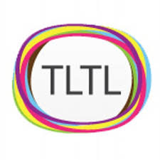

.. _contact:

########
Contact
########

Unfold Studio and this documentation was created by `Chris Proctor`_, a PhD candidate in Learning Sciences
and Technology Design at Stanford's Graduate School of Education. Chris is a member of the Transformative
Learning Technologies Lab, led by his advisor Paulo Blikstein. Please feel free to contact Chris at 
cproctor@stanford.edu.

Citing Unfold Studio
====================

The paper
~~~~~~~~~
Proctor, C. & Blikstein, P. (2018). *Unfold.studio: Suporting critical literacies of text & code.*
Manuscript submitted for publication.
::

    @unpublished{proctor2018,
        author = "Proctor, C. and Blikstein, P.",
        year   = 2018,
        title  = "Unfold.studio: Suporting critical literacies of text & code.",
        notes  = "Manuscript in submission."
        url    = "http://chrisproctor.net/text-and-code.html"
    }
        

The software
~~~~~~~~~~~~

Proctor, C. (2018). Unfold Studio [Computer software]. Retrieved from https://github.com/cproctor/unfold_studio
::

    @misc{
        author = "Proctor, C.",
        year   = 2018,
        title  = "Unfold Studio",
        url    = "https://unfold.studio",
        howpublished = {\url{https://github.com/cproctor/unfold_studio}},
    }

The documentation (including teaching guide)
~~~~~~~~~~~~~~~~~~~~~~~~~~~~~~~~~~~~~~~~~~~~

Proctor, C. (2018). Unfold Studio Documentation and Teaching Guide. Retrieved from http://docs.unfold.studio
::

    @manual{proctor2018doc,
        author = "Proctor, C.",
        year   = 2018,
        title  = "Unfold Studio Documentation and Teaching Guide",
        url    = "http://docs.unfold.studio"
    }

.. _Chris Proctor: http://chrisproctor.net
